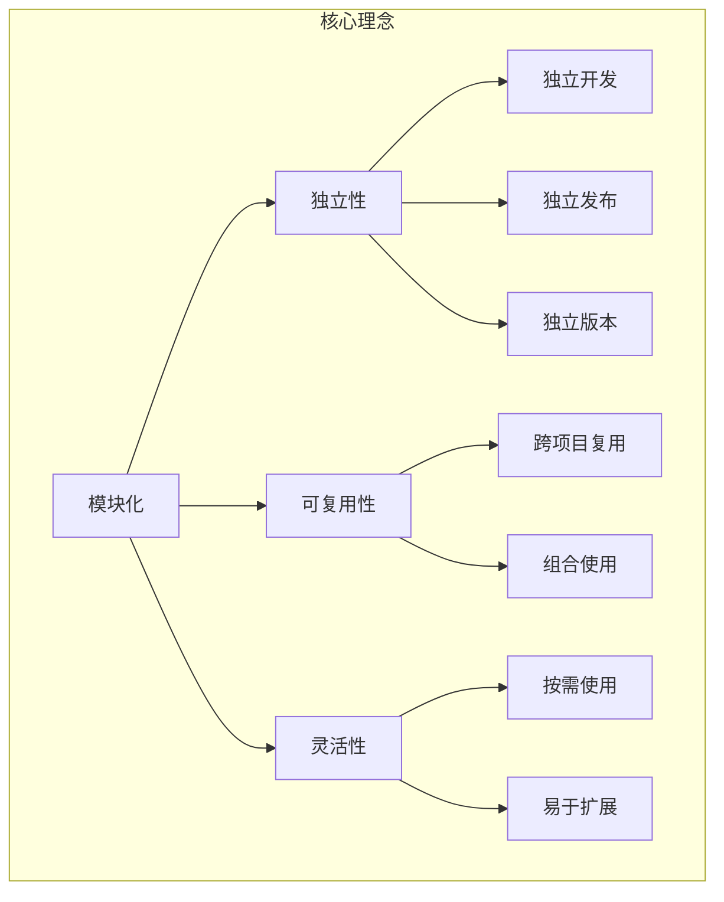
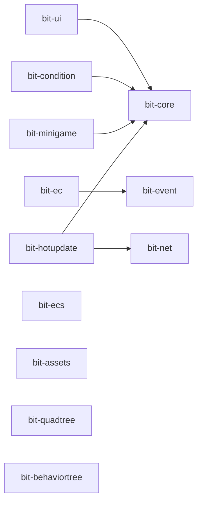
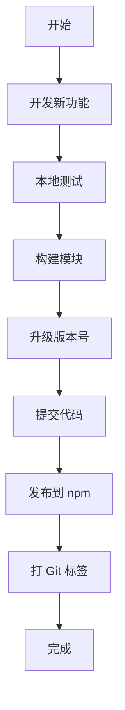

# Bit Framework 架构设计文档

> 本文档详细介绍 Bit Framework 的整体架构设计、模块分层、技术选型和设计原则。

## 📋 目录

- [架构总览](#架构总览)
- [Monorepo 架构](#monorepo-架构)
- [模块分层设计](#模块分层设计)
- [技术栈说明](#技术栈说明)
- [设计原则](#设计原则)
- [模块依赖关系](#模块依赖关系)
- [构建系统](#构建系统)
- [发布策略](#发布策略)

---

## 架构总览

Bit Framework 是一个基于 **Monorepo** 架构的游戏开发框架集合，专为 Cocos Creator 3.x 设计。它将常用的游戏开发功能模块化，每个模块独立开发、测试和发布，同时又能在统一的仓库中高效协作。

### 核心理念



### 架构优势

1. **模块化** - 功能独立，职责清晰
2. **可组合** - 按需选择，灵活组合
3. **类型安全** - TypeScript 全覆盖
4. **高性能** - 优化的数据结构和算法
5. **易维护** - 统一管理，独立发布

---

## Monorepo 架构

### 为什么选择 Monorepo？

Bit Framework 选择 Monorepo 架构而不是多个独立仓库，主要基于以下考虑：

1. **统一的代码管理**
   - 所有模块在同一个仓库中
   - 统一的版本控制和提交历史
   - 便于跨模块的重构和更新

2. **简化的依赖管理**
   - 共享依赖，避免重复安装
   - 统一的依赖版本管理
   - 跨模块引用无需发布即可测试

3. **高效的协作开发**
   - 原子性的跨模块提交
   - 统一的 CI/CD 流程
   - 便于代码审查和知识共享

4. **更好的开发体验**
   - 一次克隆获取所有代码
   - 统一的开发工具和配置
   - 快速的本地测试和调试

### pnpm Workspace 配置

```yaml
# pnpm-workspace.yaml
packages:
  # 12 个库模块
  - 'bit-core'
  - 'bit-ui'
  - 'bit-ecs'
  - 'bit-ec'
  - 'bit-event'
  - 'bit-net'
  - 'bit-quadtree'
  - 'bit-assets'
  - 'bit-behaviortree'
  - 'bit-condition'
  - 'bit-minigame'
  - 'bit-hotupdate'
  # 演示项目
  - 'demo'
```

### Workspace 特性

1. **依赖链接**
   ```json
   {
     "dependencies": {
       "@gongxh/bit-core": "workspace:*"
     }
   }
   ```
   使用 `workspace:*` 自动链接到本地模块

2. **并行构建**
   ```bash
   pnpm -r --parallel build  # 并行构建所有模块
   ```

3. **过滤执行**
   ```bash
   pnpm --filter @gongxh/bit-core build  # 只构建特定模块
   ```

---

## 技术栈说明

### 核心技术

| 技术 | 版本 | 用途 |
|------|------|------|
| **TypeScript** | 5.x | 开发语言，提供类型安全 |
| **pnpm** | 8.x+ | 包管理器，支持 workspace |
| **Rollup** | 4.x | 构建工具，打包模块 |
| **Cocos Creator** | 3.7.0+ | 游戏引擎 |
| **FairyGUI** | 1.2.2 | UI 编辑器（bit-ui 使用） |

### TypeScript 配置

每个模块都有独立的 `tsconfig.json`，基本配置：

```json
{
  "compilerOptions": {
    "target": "ES6",
    "module": "ES6",
    "strict": true,
    "strictNullChecks": false,
    "experimentalDecorators": true,
    "declaration": true,
    "declarationMap": true,
    "esModuleInterop": true,
    "skipLibCheck": true
  }
}
```

**关键配置说明**:
- `experimentalDecorators`: 支持装饰器语法（UI、EC 模块需要）
- `declaration`: 生成 `.d.ts` 类型定义文件
- `strictNullChecks: false`: 考虑到 Cocos Creator 的特性

### Rollup 构建配置

统一的构建配置 `rollup.config.base.mjs`:

```javascript
export function createRollupConfig(packageName, external = ['cc']) {
  return [
    {
      input: 'src/index.ts',
      output: [
        { file: `dist/${packageName}.mjs`, format: 'esm' },
        { file: `dist/${packageName}.cjs`, format: 'cjs' }
      ],
      plugins: [typescript()]
    },
    {
      // 压缩版本
      output: [
        { file: `dist/${packageName}.min.mjs`, format: 'esm' },
        { file: `dist/${packageName}.min.cjs`, format: 'cjs' }
      ],
      plugins: [typescript(), terser()]
    },
    {
      // 类型定义
      output: { file: `dist/${packageName}.d.ts`, format: 'es' },
      plugins: [dts()]
    }
  ];
}
```

**输出格式**:
- `.mjs` - ES Module 格式
- `.cjs` - CommonJS 格式
- `.min.mjs` / `.min.cjs` - 压缩版本
- `.d.ts` - TypeScript 类型定义

---

## 设计原则

### 1. 模块化优先

**原则**: 每个模块只做一件事，并且做好

**实践**:
- 清晰的模块边界
- 单一职责原则
- 避免模块间的循环依赖

**示例**:
```typescript
// ✅ 好的设计 - 职责清晰
bit-core     → 基础工具
bit-event    → 事件系统
bit-net      → 网络通信

// ❌ 避免的设计 - 职责混乱
bit-core → 包含所有功能（过于臃肿）
```

### 2. 依赖最小化

**原则**: 尽量减少外部依赖，保持轻量

**实践**:
- 运行时零依赖（除引擎）
- 开发依赖统一管理
- 避免不必要的传递依赖

**依赖策略**:
```json
{
  "dependencies": {
    // 仅核心必需
    "@gongxh/bit-core": "workspace:*"
  },
  "devDependencies": {
    // 开发和构建工具
    "typescript": "^5.0.0",
    "rollup": "^4.0.0"
  }
}
```

### 3. 类型安全

**原则**: 充分利用 TypeScript 的类型系统

**实践**:
- 导出完整的类型定义
- 避免使用 `any`
- 提供泛型支持

**示例**:
```typescript
// 提供完整的类型定义
export class World {
  createEntity<T extends Component>(name: string): Entity {
    // ...
  }
  
  getComponent<T extends Component>(
    entity: Entity, 
    type: ComponentType<T>
  ): T | null {
    // ...
  }
}
```

### 4. 性能优先

**原则**: 游戏开发对性能敏感，优先考虑性能

**实践**:
- 使用对象池减少 GC
- 密集数据结构
- 避免不必要的装箱拆箱

**示例**:
```typescript
// bit-ecs 使用对象池
export class ComponentPool<T extends Component> {
  private pool: T[] = [];
  
  acquire(): T {
    return this.pool.pop() || this.create();
  }
  
  release(component: T): void {
    component.reset();
    this.pool.push(component);
  }
}
```

### 5. 可扩展性

**原则**: 提供扩展点，支持用户定制

**实践**:
- 使用抽象类和接口
- 提供生命周期钩子
- 支持自定义组件

**示例**:
```typescript
// bit-ui 的窗口基类
export abstract class Window {
  // 生命周期钩子
  protected onInit(): void {}
  protected onShow(userdata?: any): void {}
  protected onClose(): void {}
  protected onHide(): void {}
}

// 用户可以继承并重写
export class MyWindow extends Window {
  protected onShow(data: any): void {
    // 自定义逻辑
  }
}
```

### 6. 向后兼容

**原则**: 尽量保持 API 的稳定性

**实践**:
- 使用语义化版本（SemVer）
- 废弃而不是删除 API
- 提供迁移指南

**版本策略**:
- `0.0.x` - 补丁版本，bug 修复
- `0.x.0` - 次版本，新功能（向后兼容）
- `x.0.0` - 主版本，破坏性变更

---

## 模块依赖关系

### 依赖图



### 依赖矩阵

| 模块 | 依赖的模块 |
|------|-----------|
| bit-core | 无 |
| bit-ui | bit-core, fairygui-cc |
| bit-ecs | 无 |
| bit-ec | bit-event |
| bit-event | 无 |
| bit-net | 无 |
| bit-quadtree | 无 |
| bit-assets | 无 |
| bit-behaviortree | 无 |
| bit-condition | bit-core, fairygui-cc |
| bit-minigame | bit-core |
| bit-hotupdate | bit-core, bit-net |

### 依赖原则

1. **核心层不依赖任何模块**
   - bit-core 保持纯净

2. **工具层保持独立**
   - bit-assets、bit-quadtree、bit-behaviortree 互不依赖

3. **功能层可依赖核心层**
   - 但避免功能层之间的依赖

4. **平台层可依赖任何底层模块**
   - 但要保持依赖关系清晰

---

## 发布策略

### 独立版本管理

每个模块独立管理版本号，互不影响：

```bash
# 升级所有模块的版本
pnpm version:patch  # 0.0.5 -> 0.0.6

# 升级单个模块
cd bit-core
npm version patch
```

### 发布流程



### 发布命令

```bash
# 1. 升级版本
pnpm version:patch

# 2. 构建
pnpm build:all

# 3. 提交
git add .
git commit -m "chore: bump version to 0.0.6"
git push

# 4. 发布到 npm（需要登录）
pnpm publish:core
pnpm publish:ui
# ... 其他模块

# 5. 打标签（可选）
git tag v0.0.6
git push --tags
```

### 发布检查清单

发布前确认：

- [ ] 代码已提交
- [ ] 所有测试通过
- [ ] 版本号已更新
- [ ] CHANGELOG 已更新
- [ ] 构建产物正常
- [ ] 已登录 npm (`npm login`)

---

## 最佳实践

### 1. 开发新模块

创建新模块时遵循以下步骤：

1. **创建目录结构**
   ```
   bit-xxx/
   ├── src/
   │   └── index.ts
   ├── dist/           # 构建产物（.gitignore）
   ├── package.json
   ├── tsconfig.json
   ├── rollup.config.mjs
   └── README.md
   ```

2. **配置 package.json**
   ```json
   {
     "name": "@gongxh/bit-xxx",
     "version": "0.0.1",
     "main": "./dist/bit-xxx.cjs",
     "module": "./dist/bit-xxx.mjs",
     "types": "./dist/bit-xxx.d.ts"
   }
   ```

3. **添加到 workspace**
   ```yaml
   # pnpm-workspace.yaml
   packages:
     - 'bit-xxx'
   ```

4. **添加构建命令**
   ```json
   // 根 package.json
   {
     "scripts": {
       "build:xxx": "pnpm --filter @gongxh/bit-xxx build"
     }
   }
   ```

### 2. 跨模块开发

在本地同时开发多个模块：

```bash
# 1. 使用 workspace 链接
# package.json
{
  "dependencies": {
    "@gongxh/bit-core": "workspace:*"
  }
}

# 2. 监听模式开发
pnpm --filter @gongxh/bit-core build --watch

# 3. 在另一个终端开发依赖模块
pnpm --filter @gongxh/bit-ui build --watch
```

### 3. 测试变更

使用 demo 项目测试变更：

```bash
# 1. 构建修改的模块
pnpm build:core

# 2. demo 会自动使用新构建的文件
# 在 Cocos Creator 中打开 demo 项目测试
```

---

## 总结

Bit Framework 的架构设计遵循以下核心思想：

1. **模块化** - 功能独立，职责清晰
2. **分层设计** - 从底层到上层，逐层抽象
3. **依赖最小** - 保持轻量，避免臃肿
4. **类型安全** - TypeScript 全覆盖
5. **性能优先** - 优化的数据结构和算法
6. **易于扩展** - 提供扩展点和钩子

这种架构设计使得 Bit Framework 既保持了整体的统一性，又具备了灵活的可扩展性，非常适合游戏开发的需求。

---

**相关文档**:
- [README.md](./README.md) - 项目总览
- [COMMANDS.md](./COMMANDS.md) - 构建与发布指南

