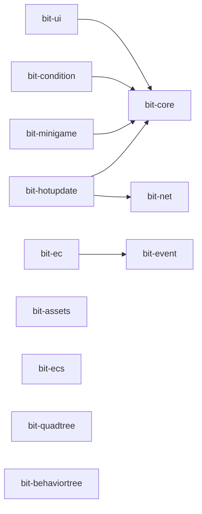

# Bit Framework

> 基于 Cocos Creator 3.x 的游戏开发框架 Monorepo

一个模块化、类型安全、高性能的 Cocos Creator 游戏开发框架集合，提供从核心功能到高级特性的完整解决方案。

[](LICENSE)
[](https://pnpm.io/)

## ✨ 特性

- 🎯 **模块化设计** - 12 个独立模块，按需使用
- 📦 **Monorepo 架构** - 统一管理，独立发布
- 💪 **TypeScript** - 完整的类型定义和智能提示
- 🚀 **高性能** - 优化的数据结构和算法
- 🔧 **零配置** - 开箱即用，简单易用
- 📖 **完善文档** - 详细的 API 文档和示例

## 📦 模块总览

Bit Framework 包含 12 个核心模块，分为 5 大类别：

### 🏗️ 核心模块

| 模块 | npm 包名 | 描述 | 文档 |
|------|---------|------|------|
| **bit-core** | [@gongxh/bit-core](https://www.npmjs.com/package/@gongxh/bit-core) | 框架核心功能库，提供 Time、Platform、Module 等基础工具 | [README](./bit-core/README.md) |

### 🎨 UI 模块

| 模块 | npm 包名 | 描述 | 文档 |
|------|---------|------|------|
| **bit-ui** | [@gongxh/bit-ui](https://www.npmjs.com/package/@gongxh/bit-ui) | 基于 FairyGUI 的 UI 管理系统，支持窗口管理、装饰器等 | [README](./bit-ui/README.md) |
| **bit-condition** | [@gongxh/bit-condition](https://www.npmjs.com/package/@gongxh/bit-condition) | 条件显示系统，用于 UI 红点、解锁等场景 | [README](./bit-condition/README.md) |

### 🎮 游戏架构模块

| 模块 | npm 包名 | 描述 | 文档 |
|------|---------|------|------|
| **bit-ecs** | [@gongxh/bit-ecs](https://www.npmjs.com/package/@gongxh/bit-ecs) | 高性能 ECS（实体组件系统）架构实现 | [README](./bit-ecs/README.md) |
| **bit-ec** | [@gongxh/bit-ec](https://www.npmjs.com/package/@gongxh/bit-ec) | 基于 Cocos Creator 的 EC 框架实现 | [README](./bit-ec/README.md) |
| **bit-event** | [@gongxh/bit-event](https://www.npmjs.com/package/@gongxh/bit-event) | 全局事件系统，支持优先级、批量操作等 | [README](./bit-event/README.md) |

### 🌐 网络与资源模块

| 模块 | npm 包名 | 描述 | 文档 |
|------|---------|------|------|
| **bit-net** | [@gongxh/bit-net](https://www.npmjs.com/package/@gongxh/bit-net) | 网络通信库，封装 HTTP 和 WebSocket | [README](./bit-net/README.md) |
| **bit-assets** | [@gongxh/bit-assets](https://www.npmjs.com/package/@gongxh/bit-assets) | 资源加载管理，支持批量加载、进度跟踪等 | [README](./bit-assets/README.md) |
| **bit-hotupdate** | [@gongxh/bit-hotupdate](https://www.npmjs.com/package/@gongxh/bit-hotupdate) | 热更新系统，支持增量更新和版本管理 | [README](./bit-hotupdate/README.md) |

### 🛠️ 工具模块

| 模块 | npm 包名 | 描述 | 文档 |
|------|---------|------|------|
| **bit-quadtree** | [@gongxh/bit-quadtree](https://www.npmjs.com/package/@gongxh/bit-quadtree) | 四叉树实现，用于高效碰撞检测和空间查询 | [README](./bit-quadtree/README.md) |
| **bit-behaviortree** | [@gongxh/bit-behaviortree](https://www.npmjs.com/package/@gongxh/bit-behaviortree) | 行为树系统，用于 AI 逻辑实现 | [README](./bit-behaviortree/README.md) |
| **bit-minigame** | [@gongxh/bit-minigame](https://www.npmjs.com/package/@gongxh/bit-minigame) | 小游戏平台适配（微信、支付宝、字节跳动） | [README](./bit-minigame/README.md) |

## 📚 项目文档

- [架构设计文档](./ARCHITECTURE.md) - Monorepo 架构、模块分层和设计原则
- [构建与发布指南](./COMMANDS.md) - 开发、构建、发布完整流程

## 🎯 模块依赖关系



## 🚀 快速开始

### 环境要求

- **Node.js**: >= 16.0.0
- **pnpm**: >= 8.0.0
- **Cocos Creator**: 3.7.0+ （推荐 3.8.x）

### 方式一：在 Cocos Creator 项目中使用（推荐）

在你的 Cocos Creator 项目中直接安装需要的模块：

```bash
# 安装核心模块
npm install @gongxh/bit-core

# 安装 UI 模块
npm install @gongxh/bit-ui

# 安装 ECS 模块
npm install @gongxh/bit-ecs

# 或一次性安装多个模块
npm install @gongxh/bit-core @gongxh/bit-ui @gongxh/bit-event @gongxh/bit-net
```

### 方式二：本地开发此框架

如果你想参与框架开发或查看源码：

#### 1. 安装 pnpm

```bash
# 使用 npm 安装
npm install -g pnpm

# 或使用 homebrew (macOS)
brew install pnpm

# 验证安装
pnpm --version
```

#### 2. 克隆仓库并安装依赖

```bash
# 克隆仓库
git clone https://github.com/gongxh0901/bit-framework.git
cd bit-framework

# 安装所有依赖
pnpm install
```

#### 3. 构建所有模块

```bash
# 构建所有库
pnpm build:all
```

#### 4. 在 demo 中测试

```bash
# 使用 Cocos Creator 打开 demo 文件夹
# demo 项目会自动使用本地构建的库文件
```

## 🛠️ 开发指南

### 构建项目

```bash
# 构建所有库项目（不包括 demo）
pnpm build

# 构建特定项目
pnpm build:core          # 只构建 bit-core
pnpm build:ui            # 只构建 bit-ui
pnpm build:ecs           # 只构建 bit-ecs
pnpm build:ec            # 只构建 bit-ec
pnpm build:event         # 只构建 bit-event
pnpm build:net           # 只构建 bit-net
pnpm build:assets        # 只构建 bit-assets
pnpm build:quadtree      # 只构建 bit-quadtree
pnpm build:behaviortree  # 只构建 bit-behaviortree
pnpm build:condition     # 只构建 bit-condition
pnpm build:minigame      # 只构建 bit-minigame
pnpm build:hotupdate     # 只构建 bit-hotupdate

# 按顺序构建所有模块
pnpm build:all

# 清理所有构建产物
pnpm clean
```

### 开发模式（监听文件变化）

```bash
# 监听 bit-core 变化并自动构建
pnpm dev:core

# 监听 bit-ui 变化并自动构建
pnpm dev:ui
```

### 在 demo 中测试

由于使用了 pnpm workspace，demo 项目会自动链接到本地的所有库：

```bash
# 1. 构建所有库
pnpm build:all

# 2. 在 Cocos Creator 中打开 demo 项目
# 项目路径: demo/
# demo 会自动使用本地构建的库文件
```

完整的开发、构建、发布流程请查看 [COMMANDS.md](./COMMANDS.md)

## 📝 版本管理

### 升级版本

```bash
# 升级补丁版本 (0.0.1 -> 0.0.2)
pnpm version:patch

# 升级次版本 (0.0.1 -> 0.1.0)
pnpm version:minor

# 升级主版本 (0.0.1 -> 1.0.0)
pnpm version:major
```

### 发布到 npm

```bash
# 发布 bit-core
pnpm publish:core

# 发布 bit-ui
pnpm publish:ui

# 注意：发布前需要：
# 1. 确保已登录 npm: npm login
# 2. 确保代码已提交
# 3. 确保版本号已更新
```

### 完整发版流程

```bash
# 1. 确保代码是最新的
git pull origin main

# 2. 升级版本号
pnpm version:patch  # 或 minor/major

# 3. 构建所有项目
pnpm build:all

# 4. 提交版本变更
git add .
git commit -m "chore: bump version to x.x.x"
git push

# 5. 发布到 npm
pnpm publish:core
pnpm publish:ui

# 6. 创建 Git tag（可选）
git tag v0.0.5
git push --tags
```

## 💡 快速选择指南

### 我应该使用哪些模块？

根据你的需求选择合适的模块组合：

#### 🎯 基础项目（推荐所有项目）
```bash
npm install @gongxh/bit-core @gongxh/bit-event
```
- `bit-core`: 提供时间、平台、模块等基础功能
- `bit-event`: 全局事件系统

#### 🎨 UI 开发（使用 FairyGUI）
```bash
npm install @gongxh/bit-ui @gongxh/bit-condition
```
- `bit-ui`: 窗口管理、装饰器等
- `bit-condition`: 红点、解锁等条件系统

#### 🎮 游戏架构
```bash
# ECS 架构
npm install @gongxh/bit-ecs

# 或 EC 架构（适配 Cocos Creator）
npm install @gongxh/bit-ec
```

#### 🌐 网络功能
```bash
npm install @gongxh/bit-net @gongxh/bit-hotupdate
```
- `bit-net`: HTTP 和 WebSocket
- `bit-hotupdate`: 热更新系统

#### 🛠️ 高级功能
```bash
# 资源管理
npm install @gongxh/bit-assets

# AI 行为树
npm install @gongxh/bit-behaviortree

# 碰撞检测
npm install @gongxh/bit-quadtree

# 小游戏平台
npm install @gongxh/bit-minigame
```


### 演示项目

`demo` 文件夹包含完整的 Cocos Creator 3.8.x 示例项目，展示了各模块的实际使用方法。

## 🔧 常见问题

### Q: 如何在我的 Cocos Creator 项目中使用？

A: 直接使用 npm 安装需要的模块：

```bash
npm install @gongxh/bit-core @gongxh/bit-ui
```

安装后可以直接在代码中导入使用。

### Q: 模块之间有依赖关系吗？

A: 部分模块有依赖关系：
- `bit-ui` 依赖 `bit-core`
- `bit-condition` 依赖 `bit-core`
- `bit-hotupdate` 依赖 `bit-core` 和 `bit-net`
- `bit-minigame` 依赖 `bit-core`
- `bit-ec` 依赖 `bit-event`

其他模块都是独立的，可以单独使用。

### Q: 为什么使用 pnpm？

A: pnpm 相比 npm/yarn 有以下优势：
- 更快的安装速度
- 节省磁盘空间（使用硬链接）
- 更严格的依赖管理
- 原生支持 monorepo

### Q: 修改源码后如何测试？

A: 需要重新构建对应模块：

```bash
# 构建特定模块
pnpm build:core

# 或构建所有模块
pnpm build:all
```

由于使用了 workspace 链接，demo 会立即使用新构建的文件。

### Q: 支持哪些 Cocos Creator 版本？

A: 
- **推荐版本**: Cocos Creator 3.8.x
- **最低支持**: Cocos Creator 3.7.0+
- **理论支持**: Cocos Creator 3.0+（部分功能可能需要调整）

### Q: 可以只使用部分模块吗？

A: 当然可以！所有模块都是独立发布的，你可以按需安装使用。只需要注意模块间的依赖关系即可。

### Q: 如何贡献代码？

A: 欢迎贡献！请按以下步骤：

1. Fork 本仓库
2. 创建你的特性分支 (`git checkout -b feature/AmazingFeature`)
3. 提交你的更改 (`git commit -m 'Add some AmazingFeature'`)
4. 推送到分支 (`git push origin feature/AmazingFeature`)
5. 开启一个 Pull Request

## 🔗 相关资源

- [pnpm 官方文档](https://pnpm.io/zh/)
- [pnpm workspace 文档](https://pnpm.io/zh/workspaces)
- [Cocos Creator 文档](https://docs.cocos.com/creator/3.8/)
- [FairyGUI 文档](https://www.fairygui.com/docs/editor)
- [TypeScript 文档](https://www.typescriptlang.org/zh/)

## 📝 更新日志

各模块的更新日志请查看对应模块的 `CHANGELOG.md` 文件。

## 📄 许可证

MIT License - 详见 [LICENSE](LICENSE) 文件

## 👥 作者与贡献者

**作者**: bit老宫 (gongxh)

**联系方式**: gong.xinhai@163.com

## 🌟 支持项目

如果这个项目对你有帮助，请给个 Star ⭐️

## 📮 反馈与建议

- 提交 [Issue](https://github.com/gongxh0901/bit-framework/issues)
- 发送邮件到 gong.xinhai@163.com

---

**💡 提示**: 
- 首次使用？建议先阅读 [架构设计文档](./ARCHITECTURE.md) 了解整体设计
- 想要参与开发？查看 [构建指南](./COMMANDS.md) 了解开发流程
- 需要示例？打开 `demo` 文件夹查看完整的使用示例

