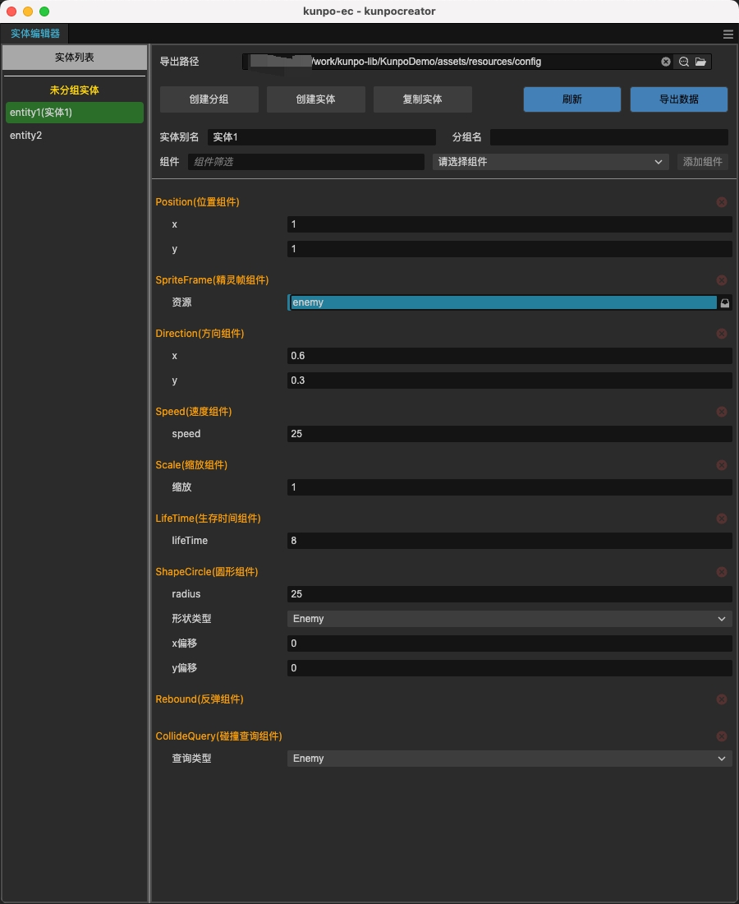

# bit-ec

基于 Cocos Creator 的 Entity-Component 框架，专为 Cocos Creator 优化的轻量级 EC 架构。

## 简介

`bit-ec` 是一套专为 Cocos Creator 设计的实体组件系统，将游戏对象（实体）的数据（组件）和行为分离。区分数据组件和逻辑组件，支持灵活的组件更新顺序管理和多世界（多战斗场景）。

**核心特性**：
- 🎯 组件更新顺序精确控制
- 🎨 灵活的 EC 装饰器
- 🌍 支持多世界（多战斗场景互不影响）
- 📊 区分数据组件和逻辑组件

**下载地址**：[Cocos Store - kunpocc-ec](https://store.cocos.com/app/detail/7311)

## 使用说明

### 组件基类 (Component)

所有组件的基类，提供组件生命周期。

**生命周期方法**：
- `onAdd()` - 组件添加到实体时调用
- `onEnter()` - 实体进入场景时调用（可获取其他组件）
- `onRemove()` - 组件从实体移除时调用
- `update(dt)` - 每帧更新（需设置 `needUpdate = true`）

**组件方法**：
- `getComponent<T>(type)` - 获取同实体上的其他组件
- `getSingleton<T>(type)` - 获取单例组件

### EC 装饰器

提供装饰器简化组件定义和配置。

**类装饰器**：
- `@ecclass(name, type, options?)` - 注册组件类
  - `name` - 组件名称
  - `type` - 组件类型（枚举值）
  - `options.describe` - 组件描述（可选）

**属性装饰器**：
- `@ecprop(config)` - 注册组件属性
  - 支持类型：int, float, string, boolean, enum, entity, array, object
  - 支持 Cocos 类型：spriteframe, prefab, skeleton, particle, animation, audio, vec2, vec3, color, size
  - 支持数组和对象嵌套

### 世界管理 (ECManager)

全局管理器，负责 EC 世界的创建和管理。

**初始化**：
- `init(ecConfig?)` - 初始化 EC 系统（只调用一次）
  - `ecConfig` - 实体配置信息（可选，通常使用编辑器导出）

**世界管理**：
- `createECWorld(worldName, node, componentUpdateOrderList, maxCapacityInPool?, preloadEntityCount?)` - 创建 EC 世界
  - `worldName` - 世界名称
  - `node` - 世界节点
  - `componentUpdateOrderList` - 组件更新顺序列表
  - `maxCapacityInPool` - 实体池最大容量（默认 300）
  - `preloadEntityCount` - 预加载实体数量（默认 10）

**实体管理**：
- `createEntity(worldName, entityName)` - 创建实体
  - `worldName` - 世界名称
  - `entityName` - 实体名称（配置表中的名称）

### 世界 (ECWorld)

EC 世界实例，管理实体和组件。

**主要方法**：
- `update(dt)` - 更新世界（每帧调用）
- `getSingleton<T>(type)` - 获取单例组件

### 典型使用流程

1. **定义组件类型** - 使用枚举定义数据组件和逻辑组件类型
2. **编写组件脚本** - 继承 Component 并使用装饰器注册
3. **配置实体** - 使用编辑器配置实体和组件属性
4. **创建世界** - 初始化 ECManager 并创建 EC 世界
5. **创建实体** - 通过配置名称创建实体
6. **更新世界** - 在游戏循环中调用 `world.update(dt)`

详细 API 请查看 `bit-ec.d.ts` 类型定义文件和编辑器文档。

## 许可证

MIT License

## 作者

**bit老宫** (gongxh)  
**邮箱**: gong.xinhai@163.com

## 源码仓库

- [GitHub](https://github.com/Gongxh0901/bit-framework)
- [npm](https://www.npmjs.com/package/@gongxh/bit-ec)
